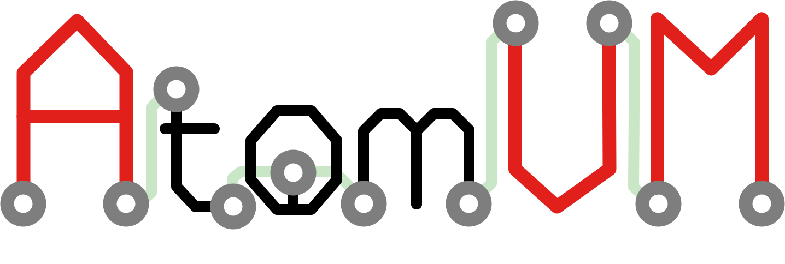

.. Copyright 2021-2022 Fred Dushin <fred@dushin.net>
..
.. SPDX-License-Identifier: Apache-2.0 OR LGPL-2.1-or-later

.. AtomVM documentation master file

Welcome to 
==============================================

Welcome to AtomVM, the Erlang virtual machine for IoT devices!

AtomVM is a lightweight implementation of the the Bogdan Erlang Abstract Machine (_aka_, the BEAM), a virtual machine that can execute byte-code instructions compiled from Erlang or Elixir source code.  AtomVM supports a limited but functional subset of the BEAM opcodes, and also includes a small subset of the Erlang/OTP standard libraries, all optimized to run on tiny micro-controllers.  With AtomVM, you can write your IoT applications in a functional programming language, using a modern actor-based concurrency model, making them vastly easier to write and understand!

AtomVM includes many advanced features, including process spawning, monitoring, message passing, pre-emptive scheduling, and efficient garbage collection.  It can also interface directly with peripherals and protocols supported on micro-controllers, such as GPIO, I2C, SPI, and UART.  It also supports WiFi networking on devices that support it, such as the Espressif ESP32.   All of this on a device that can cost as little as $2!

.. warning::  AtomVM is currently in Alpha status.  Software may contain bugs and should not be used for mission-critical applications.  Application Programming Interfaces may change without warning.

.. toctree::
   :maxdepth: 2
   :caption: Contents:

   welcome-to-atomvm
   release-notes.md
   getting-started-guide
   programmers-guide
   example-programs
   network-programming-guide
   build-instructions
   atomvm-internals
   memory-management
   packbeam-format
   api-reference-documentation

.. toctree::
   :hidden:

   CONTRIBUTING.md
   CHANGELOG.md
   UPDATING.md

Indices and tables
==================

* :ref:`genindex`
* :ref:`modindex`
* :ref:`search`
